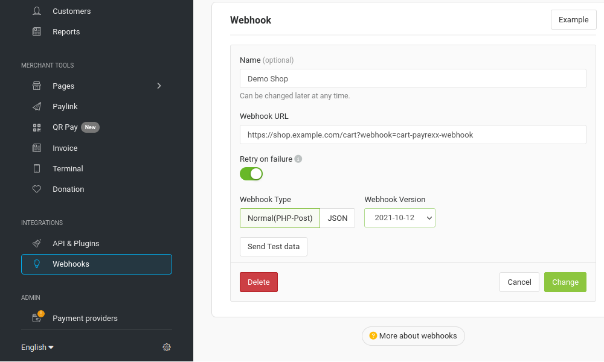

.. include:: ../../../Includes.txt

Webhook Configuration
=====================

In order for the order to be updated after successful or cancelled payment, a
new webhook must be created in the Payrexx backend under *Integrations* -> *Webhooks*.
The URL of the shopping cart should be entered as the **Webhook URL** with the
following GET paramerter: `webhook=cart-payrexx-webhook`.
Assuming the URL to the shopping cart of the store is :samp:`https://shop.example.com/cart`,
the **Webhook URL** would be :samp:`https://shop.example.com/cart?webhook=cart-payrexx-webhook`.

The **Webhook Type** must be set to Normal(PHP post).
JSON is currently not processed by the middleware.

   Example configuration for a webhook. The Webhook Type must be set to Normal(PHP-Post), the Webhook URL must be adapted to your own store accordingly.
